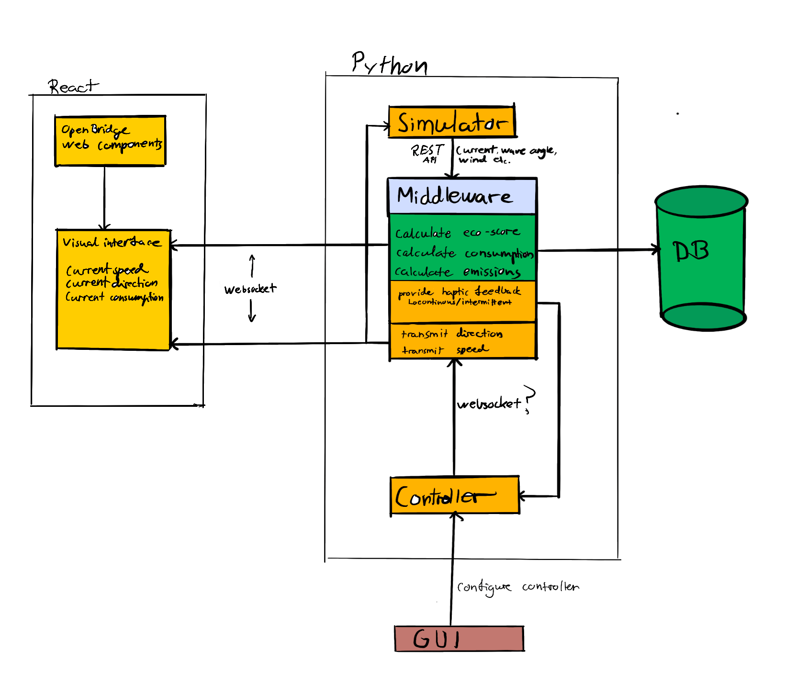

# Project Setup Instructions

## Backend

1. Navigate to the Middleware folder.
2. Create a Python virtual environment:
   python -m venv venv
3. Activate the virtual environment:
   - Windows: venv\Scripts\activate.ps1
   - macOS/Linux: source venv/bin/activate
4. Install dependencies:
   pip install -r requirements.txt
5. Run the FastAPI server:
   uvicorn main:app --reload

## Frontend

1. Navigate to the Dashboard folder.
2. Install Node.js dependencies:
   npm install
3. Start the React development server:
   npm start

### Flow Explanation:

Controller → Backend: The controller sends changes in speed and direction to the Backend.
Backend → Simulator: Backend sends the updated speed and direction to the simulator via the API.
Simulator → Backend: Simulator responds with additional data (e.g., environmental factors like wave angle, wind speed).
Backend (Calculations): Backend calculates consumption, emissions, and eco-score using the simulator data and controller inputs.
Backend → Visual Interface: Backend sends the aggregated data (speed, direction, consumption, etc.) to the React frontend.

### Activate and run the Python backend in one terminal:

cd backend
uvicorn main:app --reload

### Run the React frontend in another terminal:

cd dashboard
npm start

# Key Components in the Architecture:

## Explanation of draft program architecture

- Backend: Acts as the core processing unit for calculating eco-scores, consumption, and emissions. Communicates with the simulator via REST API. Sends data to the visual interface (React) via WebSocket.

- Visual Interface (React): Displays the current speed, direction, and consumption. Can receive real-time updates from the Backend via WebSocket.

- Controller: Connects to the Backend. Transmits speed and direction information.

- Database: Connects to the Backend. Stores historical data for analysis or display. Uses the lightweight SQLite3 RDBM system, as this whole system is not very large, and will not surpass the prototype and developmental stage.

- Simulator: Connects to the Backend. Provides environmental data (e.g., wind, wave angles).

## Layered architecture

1️⃣ **Application Layer**

- Implements business logic and service orchestration.
- Manages vessel state and eco-feedback processing.

2️⃣ **Domain Layer**

- Defines entities (e.g., `Vessel`, `Weather`) to model data and behavior.

3️⃣ **Infrastructure Layer**

- Provides external integrations such as database access, COSLaunch API communication, and real-time updates.

4️⃣ **Presentation Layer**

- Exposes functionality via REST API or WebSockets.

